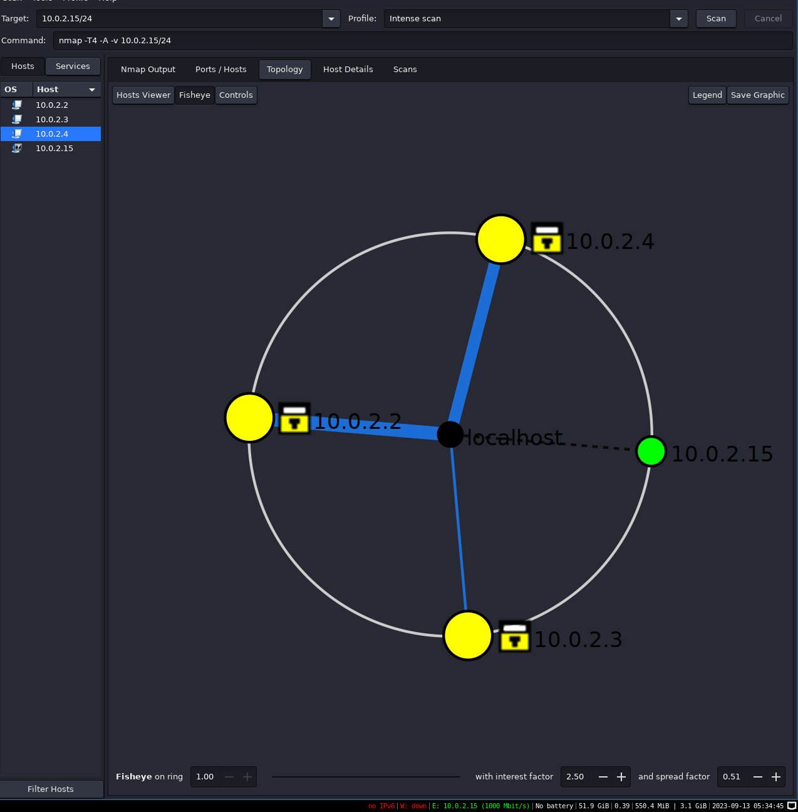
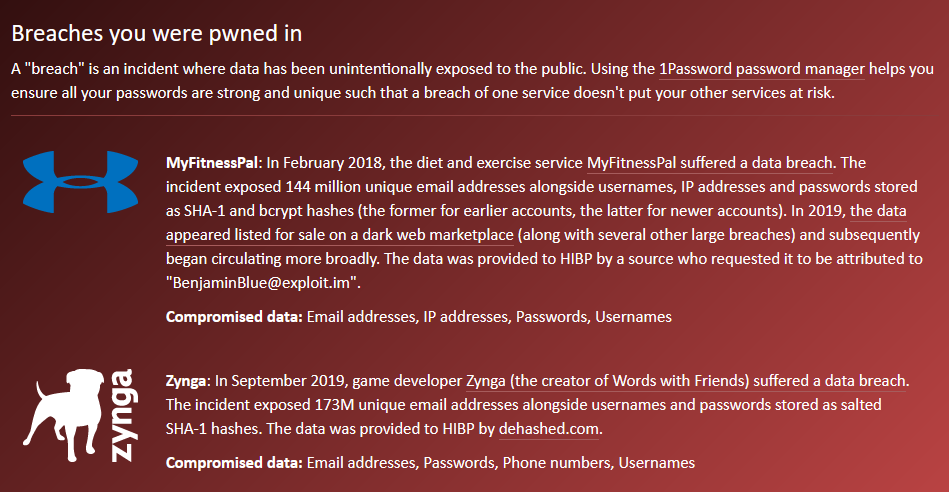
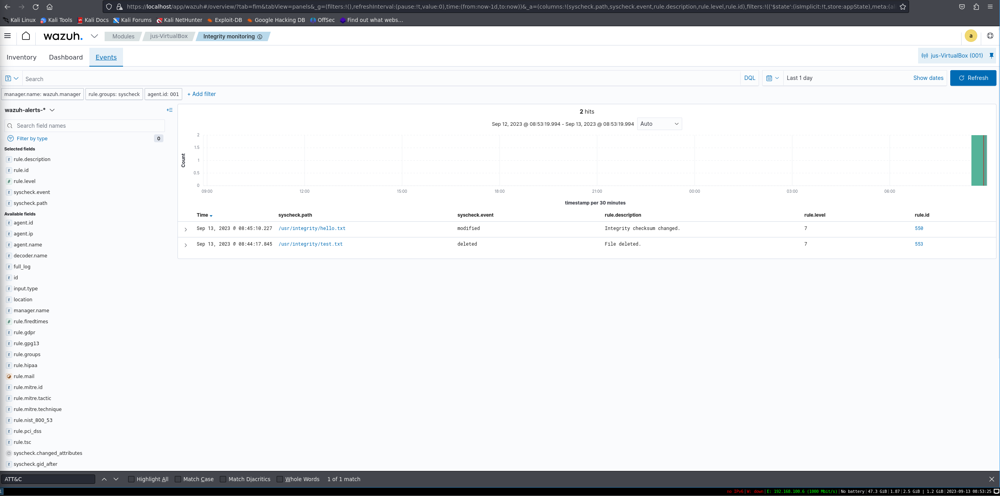

# Task 4: Security Audit

## Task 4A: Network scan
**1. Did you find devices you did not know were in your network?**  
Nope, all the devices in the network are known "devices" (ran the scan on a VM).

**2. Were there open ports which should have been closed?**  
Perhaps? There was some unnecessary printer service using a port, but I'm running a VM so I'm not too converned about that.

**3. Did nmap find any vulnerabilities with the scripts?**  
Yes, unnecessary open ports increase the attack surface thus are vulnerabilities. It's hard to be sure if the software that uses the port has been patched, so it's better to assume the worst case scenario.

**4. Screenshot of the topology of your network. You can redact device information if you want.**

## Task 4B: Account Security

**1. Has your account details leaked?**  
Yes, unfortunately my "main" email has been in two breaches. I used my main email to register to all services back when I was a teenager before becoming more security-oriented.

**2. Screenshot of haveibeenpwned search, you can redact information if you want.** 

**3. Did you change passwords and/or email + password combos, that were leaked, if not, do it**  
Yes, I changed my email's password and created new emails to avoid using the same one for absolutely everything.

## Task 4C: Wazuh

**1. What rule descriptions did you get?**  
After deleting a file from `/integrity`: File deleted.  
After changing the permissions of a file in `/integrity`: Integrity checksum changed.

**2. What are the MITRE ATT&CK techniques (include ID) Wazuh reports for these events?**  
For deleting: `rule.mitre.techinque: Data Destruction` (ID T1485).  
For changing permission level: `rule.mitre.technique: Sudo and Sudo Caching` (ID T1548.003).

**3. What is the reported MITRE techniques for deleting files or directories inside monitored directories?**  
`rule.mitre.techinque: Data Destruction`

**4. Explain in your own words where, when and why should these systems be used.**  
SIEMs should be used on computers/machines in order to monitor and log security events. Depending on the SIEM, it can be installed on multitude of platforms such as laptops, IoT devices running Linux or mobile devices.

In a perfect world, SIEMs should be used whenever a user needs to manage more than one device. Realistically, after briefly using Wuzah, I got the impression that SIEMs are useful whenever you have to monitor and log actions on any number of computers. The more computers you need to monitor, the more you are going to benefit from using a SIEM.

SIEMs should be used for security reasons such as: 
- Catching malicious users (both internal and external)
- Prevent breaches via detecting security vulnerabilities
- In case of a breach, to see how the adversary was able to get foothold and what was done
- Legal reasons  

Other scenario is that a computer contains files with sensitive information, such as API-keys, SSH-keys, or customer data or PII-data. The folders containing sensitive data can be set under strict alarms which will automatically notify the administrators' in case of a malicious event occuring, such as file permission modification, running commands on the files (as root/admin), or modifying the file contents.

**5. Add a screenshot of your integrity monitoring events tab.**  
